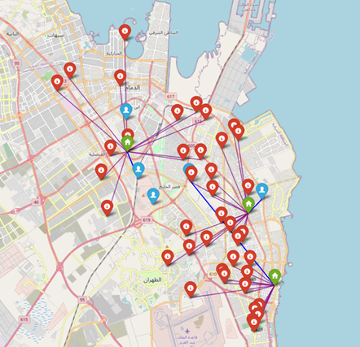
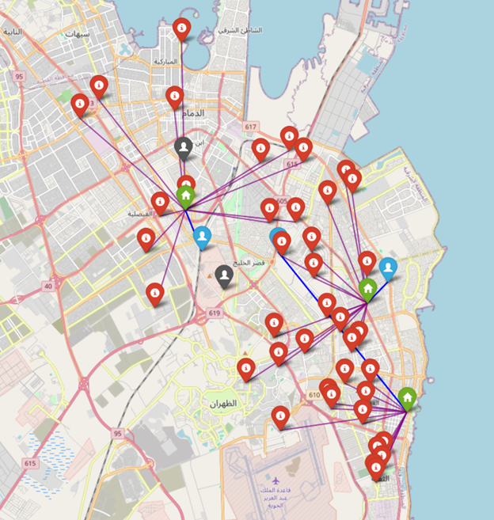
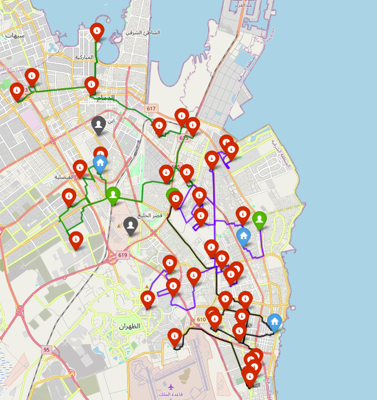

[](https://github.com/ai4smlab/Crowdsourced-LMD/blob/main/LICENSE)


<div align="center">

# Hybrid Optimization Framework for Crowdsourced Last-Mile Delivery 

Mohammed Alromema, Osamah H. Hussein, Ahmed AlHanbli, Ahmed Azab, Alaa Khamis

</div>

### 🧭 Project Overview  

Crowdsourced last-mile delivery (LMD) platforms such as **Shgardi** connect independent couriers with delivery requests, providing scalability and flexibility.  
This repository presents a **hybrid optimization framework** that integrates **machine learning** and **optimization algorithms** to improve courier–task allocation and routing efficiency in real-world conditions.  

The framework combines:  
- 🔹 **Predictive analytics (XGBoost)** for estimating courier acceptance probabilities  
- 🔹 **Integer Linear Programming (ILP)** for exact optimization  
- 🔹 **Metaheuristics:** *Simulated Annealing (SA)*, *Genetic Algorithm (GA)*, *Adaptive GA (AGA)*, and *Adaptive SA (ASA)* for scalable real-time solutions  


### 🧠 Methodology Summary  

1. **Acceptance Prediction (ML):**  
   - Trained on 6,210 labeled samples from 345 Saudi couriers.  
   - Features include delivery distance, compensation, and time windows.  
   - **XGBoost** achieved the highest predictive performance among RF, ANN, and Ensemble models.  

2. **Optimization Models:**  
   - **ILP:** Ensures optimal assignment but requires high computation time.  
   - **SA, GA, ASA, AGA:** Metaheuristics offering near-optimal solutions efficiently for real-time deployment.  

3. **Dataset:**  
   - Real-world operational data from **Shgardi (Al-Khobar, Saudi Arabia)**.  
   - Includes 5 couriers, 3 hubs, and 40 customer requests.  


### 🗺️ Sample Results  

**Figure 1 — ILP Assignment Solution**  


**Figure 2 — GA Assignment Solution**  


**Figure 3 — AGA Routing Solution**  


> ILP yields highly structured optimal routes but takes longer computation time.  
> GA achieves nearly the same performance in a fraction of the time.  

### 📊 Comparative Performance Table  

| Metric | ILP | SA | GA | ASA | AGA |
|:--|:--:|:--:|:--:|:--:|:--:|
| **Objective Value (Avg) [Km]** | **254.431** | 259.627 | 256.769 | 259.534 | 256.014 |
| **Std. Deviation [Km]** | 0 | 1028.71 | 1020.46 | 786.90 | 999.93 |
| **GBU Time (seconds)** | 20m 38s | 5m 38s | 3m 51s | 5m 45s | **3m 9s** |
| **Scalability** | Limited | High | High | High | High |
| **Optimality Guarantee** | Optimal | Near-opt. | Near-opt. | Near-opt. | Near-opt. |
| **Flexibility (Real-Time)** | Low | High | High | High | High |

> 🧾 *Adaptive Genetic Algorithm (AGA) reaches ILP-level optimality in 15% of the runtime.*

### ⚙️ Data Description  

| Dataset | Description |
|:--|:--|
| **data/training_data.xlsx** | Training data for courier acceptance prediction (ML model). |
| **data/Shgardi_data.xlsx** | Geographic coordinates for couriers, customers, and centers used for routing and optimization. |

### 💻 Code & Reproducibility  

The full pipeline, including ML model training, ILP, metaheuristics, and visualization, is implemented in Python.

📘 **Notebook:**  
[📥 Download `Crowdsourced_LMD_code.ipynb`](Crowdsourced_LMD_code.ipynb)

📦 **Dependencies:**  
`xgboost`, `scikit-learn`, `geopy`, `pulp`, `osmnx`, `networkx`, `folium`, `numpy`, `pandas`, `matplotlib`


### 📈 Key Findings  

✅ **ILP:** Optimal but computationally heavy (20.38 min).  
✅ **SA / GA:** Near-optimal, fast (5–3 min).  
✅ **AGA:** Achieves ILP-level accuracy in 3.1 min — **best trade-off** between quality and efficiency.  
✅ **Hybrid model:** Integrating ML-driven acceptance prediction improves assignment quality, delivery reliability, and system scalability.  

## 🔖 Citation

If you use this framework or datasets, please cite:  

Plain text (IEEE style):

Alromema, M., Hussein, O.H., AlHanbli, A., Azab, A., & Khamis, A., "Hybrid Optimization Framework for Crowdsourced Last-Mile Delivery," submitted to 2026 IEEE International Conference on Smart Mobility.

BibTeX:
```
@article{khan2025sdv,
  title   = {Hybrid Optimization Framework for Crowdsourced Last-Mile Delivery},
  author  = {Alromema, M., Hussein, O.H., AlHanbli, A., Azab, A., & Khamis, A.},
  journal = {Submitted to 2026 IEEE International Conference on Smart Mobility},
  year    = {2025}
}
```


### 🏁 Acknowledgment  

Research conducted at **King Fahd University of Petroleum and Minerals (KFUPM)**, supported by **Shgardi** operational data from Al-Khobar, Saudi Arabia.  